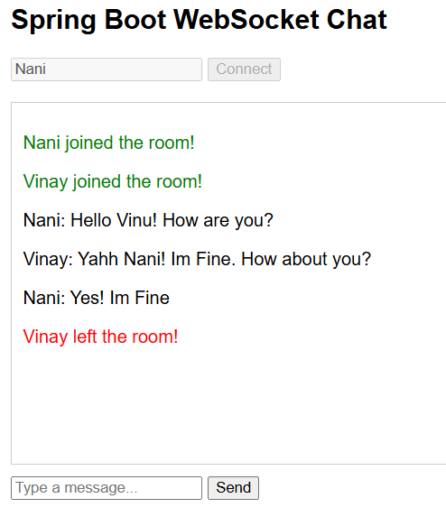
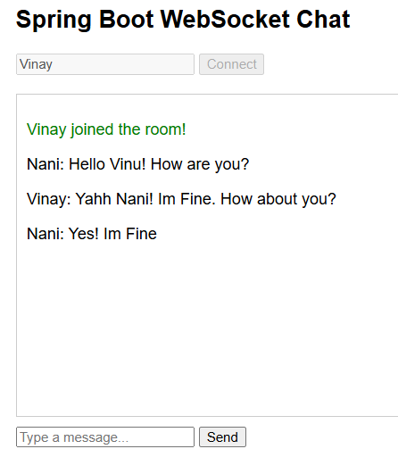

# Real-Time WebSocket Chat Broker

<div align="center">

[](https://openjdk.org/)
[](https://spring.io/projects/spring-boot)
[](https://developer.mozilla.org/en-US/docs/Web/API/WebSockets_API)
[](https://stomp.github.io/)
[](https://sockjs.github.io/sockjs-client/)

### ⚡ Persistent, Full-Duplex Group Chat Using Spring Boot + WebSocket + STOMP

A real-time chat application that demonstrates event-driven architecture, Publish/Subscribe messaging, session tracking, and graceful client disconnect handling.

</div>

---

# 📖 Table of Contents

* [Features](#-features)
* [Architecture Overview](#-architecture-overview)
* [Tech Stack](#️-tech-stack)
* [Project Structure](#-project-structure)
* [How It Works](#-how-it-works)
* [Screenshots](#️-screenshots)
* [Getting Started](#-getting-started)
* [WebSocket Endpoints](#-websocket-endpoints)
* [Message Flow](#-message-flow)
* [Sample STOMP Frames](#-sample-stomp-frames)
* [Disconnect Handling](#️-disconnect-handling)
* [Future Improvements](#-future-improvements)
* [Author](#-author)

---

# ✨ Features

* Persistent WebSocket connection between client and server
* Full-duplex communication without repeated HTTP requests
* Multiple users connected simultaneously in a shared chat room
* STOMP-based semantic message routing
* Publish/Subscribe messaging using `/topic/public`
* Automatic join and leave notifications
* Real-time message broadcasting to all connected clients
* Session tracking with disconnect event listeners
* SockJS fallback when native WebSocket is unavailable
* Lightweight frontend built with plain HTML, CSS, and JavaScript

---

# Architecture Overview

```text
┌────────────┐      WebSocket/STOMP      ┌────────────────────┐
│  Client A  │ ───────────────────────▶ │                    │
├────────────┤                          │                    │
│  Client B  │ ───────────────────────▶ │  Spring Boot App   │
├────────────┤                          │ + In-Memory Broker │
│  Client C  │ ───────────────────────▶ │                    │
└────────────┘                          │                    │
                                       └─────────┬──────────┘
                                                 │
                                                 ▼
                                      /topic/public subscribers
```

The application uses Spring's in-memory message broker.

1. Publish messages to an application destination.
2. The server processes the message.
3. The broker broadcasts it to every subscriber listening on the topic.

---

# Tech Stack

## Backend

| Technology       | Purpose                       |
| ---------------- | ----------------------------- |
| Java 21          | Core language                 |
| Spring Boot 4.x  | Application framework         |
| Spring WebSocket | WebSocket support             |
| STOMP            | Structured messaging protocol |
| Spring Messaging | Topic-based message routing   |

## Frontend

| Technology         | Purpose                     |
| ------------------ | --------------------------- |
| HTML5              | UI structure                |
| CSS3               | Styling                     |
| Vanilla JavaScript | Client-side logic           |
| SockJS             | WebSocket fallback          |
| STOMP.js           | STOMP client implementation |

---

# 📂 Project Structure

```text
spring-boot-websocket-chat/
├── src/
│   ├── images/
│   │   ├── nani.png
│   │   └── vinay.png
│   └── main/
│       ├── java/com/prashanth291/spring_boot_websocket_chat/
│       │   ├── ChatController.java
│       │   ├── ChatMessage.java
│       │   ├── SpringBootWebsocketChatApplication.java
│       │   ├── WebSocketConfig.java
│       │   └── WebSocketEventListener.java
│       └── resources/
│           ├── static/
│           │   └── index.html
│           ├── templates/
│           └── application.properties
├── .gitattributes
├── .gitignore
├── mvnw
├── mvnw.cmd
├── pom.xml
└── README.md

```


| File                          | Responsibility                                    |
| ----------------------------- | ------------------------------------------------- |
| `WebSocketConfig.java`        | Registers endpoint and configures broker          |
| `ChatController.java`         | Receives and broadcasts chat messages             |
| `WebSocketEventListener.java` | Handles disconnect events and leave notifications |
| `ChatMessage.java`            | DTO carrying sender, content, and type            |

---

# How It Works

### 1. Client Connects

The browser establishes a WebSocket connection to:

```text
/ws
```

SockJS is used as a fallback if direct WebSocket connections fail.

### 2. Client Subscribes

After connecting, the client subscribes to:

```text
/topic/public
```

Every message sent to this topic is automatically delivered to all connected users.

### 3. User Sends a Message

The client publishes a STOMP message to:

```text
/app/chat.sendMessage
```

### 4. Server Broadcasts Message

Spring routes the message to the controller and rebroadcasts it through:

```text
/topic/public
```

### 5. All Clients Receive the Message

Every connected client updates its UI immediately without refreshing the page.

---

# Screenshots

## 👤 Client 1 — Nani



> Establishes the connection and receives all broadcasted messages in real time.

## 👤 Client 2 — Vinay



> Connects from another browser session and instantly joins the same shared chat room.

---

# Getting Started

## 1️⃣ Clone the Repository

```bash
git clone https://github.com/prashanth291/spring-boot-websocket-chat.git
cd spring-boot-websocket-chat
```

## 2️⃣ Run the Application

Using Maven Wrapper:

```bash
./mvnw spring-boot:run
```

Or on Windows:

```bash
mvnw.cmd spring-boot:run
```

## 3️⃣ Open the Application

Navigate to:

```text
http://localhost:8080
```

## 4️⃣ Test Real-Time Communication

* Open the app in two browser tabs.
* Enter different usernames.
* Send messages from one tab.
* Verify they appear instantly in the other tab.

If you only test with one tab, you are not testing WebSocket behavior. You are testing a glorified local textbox.

---

# WebSocket Endpoints

| Endpoint                | Type               | Purpose                              |
| ----------------------- | ------------------ | ------------------------------------ |
| `/ws`                   | WebSocket Endpoint | Initial connection endpoint          |
| `/app/chat.sendMessage` | Publish            | Send chat message                    |
| `/app/chat.addUser`     | Publish            | Notify server that a new user joined |
| `/topic/public`         | Subscribe          | Receive all broadcasted messages     |

---

# Message Flow

```text
Client ── SEND ──▶ /app/chat.sendMessage
                     │
                     ▼
            ChatController.java
                     │
                     ▼
         /topic/public broadcast
                     │
                     ▼
      All subscribed clients receive it
```

---

# Sample STOMP Frames

## Client Subscribe

```text
SUBSCRIBE
id:sub-0
destination:/topic/public
```

## Send Chat Message

```text
SEND
destination:/app/chat.sendMessage
content-type:application/json

{
  "sender": "Prashanth",
  "content": "Hello everyone!",
  "type": "CHAT"
}
```

## Broadcasted Response

```text
MESSAGE
subscription:sub-0
destination:/topic/public

{
  "sender": "Prashanth",
  "content": "Hello everyone!",
  "type": "CHAT"
}
```

---

# Disconnect Handling

Users close tabs, lose internet, refresh the page, or kill the browser process.

This project handles that properly using `SessionDisconnectEvent`.

When a user disconnects unexpectedly:

* The session is detected automatically.
* The username is extracted from session attributes.
* A `LEAVE` event is created.
* Remaining users receive a real-time notification.

Example leave message:

```text
Prashanth left the chat.
```

---

# 👨‍💻 Author

**Prashanth Kumar**

* GitHub: `https://github.com/prashanth291`
* LinkedIn: `https://linkedin.com/in/prasanth-kumar-bollinedi`


---

